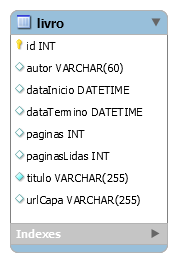

# Histórico de Leituras
Esse projeto foi criado devido a um desafio proposto pela ESIG Software e Consultoria para participar do processo seletivo para a vaga de Desenvolvedor Java.

Foi criado uma aplicação Web para fazer um histórico dos livros que uma pessoa leu. O livro tem portanto: Título; Autor; URL da Capa; Data de Início e Término da Leitura; Total de Páginas do livro e o que foi lido já.

Para o desenvolvimento da aplicação foi utilizado JSF para a construção das páginas e foi tentado utilizar as melhores práticas de SOLID (principalmente de desacropação), Orientação a Objetos e todo o meu conhecimento em todo o Backend. Também foi investido na parte da visualização das telas (UI/UX) pois acredito que seja essencial que um sistema seja eficiente tanto no seu Backend como no Frontend pois é através do Frontend, predominantemente, que o usúario terá acesso a toda aplicação portanto precisa ser algo moderno e amigável.

É possível cadastrar, atualizar e remover um livro (o famoso CRUD). Os dados são persistidos em um banco de dados MySQL.

Dessa forma, foi cumprido os requisitos mínimos da seleção A e B. Além disso, utilizou-se o item C dos requisitos adicionais que é utilizar Hibernate e JPA.

O item G também foi cumprido, pois está sendo utilizado PrimeFaces nas telas de Cadastro e Listagem pois ele deixa o trabalho com a interface muito mais prático e possui métodos excelentes para lidar com dados em suas tabelas. Porém para ter um visual um pouco mais moderno foram feitas alterações manuais no CSS tanto inline como em um arquivo style.css.

Existem duas opções de listagem dos livros:
#1: Uma tabela padrão, ideal para Desktop;
#2: Em formato grid, exibe a imagm da capa do livro e é responsivél em celulares.

Por não ter estudado JUnit ainda (já ouvi falar que é o melhor para isso), foram realizados testes manuais através das classes CriaTabelas, TestesRepositorioLivros e TestesLivroServicoSave para checar se todas as regras de negócio adicionais estavam funcionando de acordo. Além de ter sido executado diversos testes diretamente na aplicação web pelo Desktop e Smartphone. Dessa forma, foi cumprido parte do item H.

Eu até tentei fazer um deploy dela no Heroku vendo alguns vídeos e lendo alguns artigos, mas por estar em ambiente Windows isso não foi uma tarefa nenhum um pouco fácil, então devido ao tempo ela irá rodar somente localmente..

Para visualizar a interface e ver a aplicação funcionando sem precisar de nenhuma configuração, basta conferir o vídeo abaixo:
https://youtu.be/BXXoVrUupLI

Resumo dos itens cumpridos:
* [X] **A. Criar uma aplicação java web utilizando JavaServer Faces (JSF)**
* [X] **B. Utilizar persistência em um banco de dados (qualquer banco desejado)**
* [X] C. Utilizar Hibernate e JPA
* [X] G. Utilizar Primefaces
* [X] H. Utilizar testes de unidades

---

## Para execução

É necessário:
Java 11
Tomcat v9.0
Maven 3.0

Será necessário criar um banco de dados no MySql chamado de livro, como abaixo:

````sql
 create table livro (
       id integer not null auto_increment,
        autor varchar(60),
        dataInicio DATETIME default null,
        dataTermino DATETIME default null,
        paginas integer,
        paginasLidas integer,
        titulo varchar(255) not null,
        urlCapa varchar(255),
        primary key (id)
    ) engine=InnoDB

````
Diagrama do banco de dados: 


Para ser possível rodar a aplicação na sua máquina e ela conseguir se conectar com o banco é necessário ter instalado o MySQL e alterar o user, password e o dburl (se necessário) contidos no arquivo persistence.xml de dentro da pasta src/main/resources/META-INF. No momento o usúario e senha estão como 'student'.


